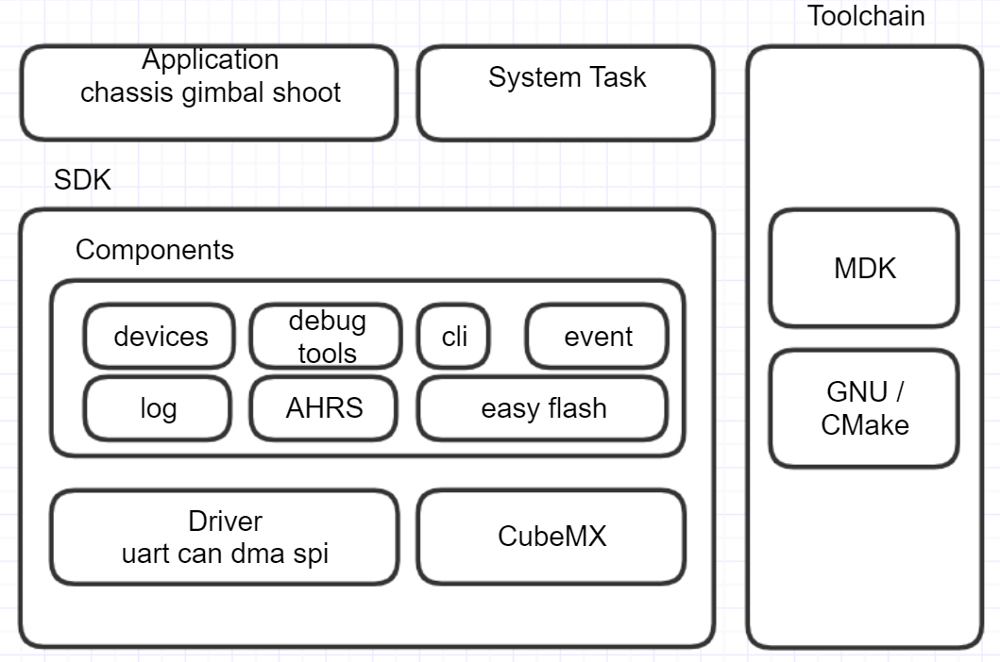

## 概述

- 这份代码完全基于 “RoboMaster 竞赛机器人 2020自组版” ，你可以在：
- “ [Development-Board-C-Examples-20](https://github.com/RoboMaster/Development-Board-C-Examples/tree/master/20.standard_robot )”中找到它的原型。
- 可以说，笔者所做的事情就是如何把一辆 ”大疆步兵车“ 改造成 ”RoboCup中型组足球机器人“。
- 毫不夸张的说，没有大疆的开源步兵，就没有今天的中型组足球机器人。
- 参考资料（1）：”[RoboRTS-Firemare](https://github.com/RoboMaster/RoboRTS-Firmware)“；（2）：”[RoboMaster 竞赛机器人 2020自组装版A型](https://www.robomaster.com/zh-CN/products/components/detail/2711)“
- doc：大疆相关教程和说明文档；Support：中型组相关支持代码和控制板
- en doc   [readme](doc/en/readme.md)

### 软件环境

 - Toolchain/IDE : MDK-ARM V5 / arm-none-eabi
 - package version: STM32Cube FW_F4 V1.24.0
 - FreeRTOS version: 10.0.0
 - CMSIS-RTOS version: 1.02

### 编程规范

- 变量和函数命名方式遵循 Unix/Linux 风格
- chassis\_task与catch\_task是强实时控制任务，优先级最高，禁止被其他任务抢占或者阻塞
- 不需要精确计时的任务，采用自行实现的软件定时器实现，定时精度受任务调度影响

### 注意事项

1.如果你是第一次拿C板烧录这份代码，你的蜂鸣器可能会以一种无比令人烦躁的频率高频振动，你可以先烧录这份代码“ [Development-Board-C-Examples-17](https://github.com/RoboMaster/Development-Board-C-Examples/tree/master/17.chassis_task) ”，不得不说，这是一个无比奇怪的BUG，如果你的问题没有解决，记得reset一下或者重新上一下电。

2.车辆正前方是x轴，俯视图下，x轴逆时针旋转90°为y轴，左前，左后，右后，右前，左持球，右持球分别代表1~6号电机。

### 车辆校准方法

- 使用遥控器进行开始校准

- 第一步:遥控器的两个开关都打到下

- 第二步:两个摇杆打成\../,保存两秒.\.代表左摇杆向右下打.（yzz:就是内八向下）

- 第三步:摇杆打成./\. 开始陀螺仪校准（其实并没有卵用）

- 或者摇杆打成'\/' 开始云台校准（其实并没有卵用）

- 或者摇杆打成/''\ 开始底盘校准

### 模块离线说明

当车辆的某个模块离线时，可以根据声光指示进行问题定位

蜂鸣器鸣叫次数按照离线模块的优先级进行错误指示，例如底盘电机优先级高于持球电机，如果同时发生离线，先指示当前离线设备是底盘电机

模块离线对应的状态如下，数字对应蜂鸣器每次鸣叫的次数，按照优先级排序：

#### 遥控器离线

此时红灯常亮，所有执行器失效

#### 底盘模块

1. 左前轮电机掉线
2. 左后轮电机掉线
3. 右后轮电机掉线
4. 右前轮电机掉线

#### 持球模块

5. 持球 LEFT 电机掉线
6. 持球 RIGHT 电机掉线

### 文档

- 协议文档  [protocol](doc/ch/protocol.md)

## 快速开始

### 硬件接口

主控板使用国际开发板 C 型，各个功能接口的位置如下：

**所需接口**

4：USB接口，用于上下位机通信

6：swd接口，用于烧录，调试

8：xt30供电接口

10：oled显示模块

11：uart1（cubeMX中实际是uart6）电磁弹射通信接口

13：can1（底盘，持球控制总线接口）

14：uart2（cubeMX中实际是uart1）adc转串通信接口

### 恼人的线序

**swd接口**：

**uart接口**：

### 功能模块

#### 手动模式：

提供遥控器基础控制。

#### 全自动模式：

这种模式下底盘、云台、发射机构受到上层 PC 的完全控制，完全控制包含对这些执行机构以具体物理单位的控制。

#### 操作档位说明：

##### 手动档

​	**底盘部分：**

​	右杆拨下：无力模式

​	右杆拨中：底盘模式

​	右杆拨上：工程模式

​	**持球部分：**

​	左杆拨下：无力模式，通过左滚轮控制内卷风量来手动持球

​	左杆拨中：持球模式，通过左滚轮控制期望电压来设置击球力度

​	左杆拨上：射击！！！

##### 自动档

正常比赛时使用（拨杆右下）

握手成功时，车辆控制权交给上位机，可以拨动右杆来临时手动接管车辆控制权

## 程序说明

### 程序体系结构

#### 体系框架

1. 使用免费及开源的 freertos 操作系统，兼容其他开源协议 license；
2. 使用标准 CMSIS-RTOS 接口，方便不同操作系统或平台间程序移植；
3. 提供一套抽象步兵机器人bsp，简化上层逻辑；

**application**：上层应用任务，包括系统任务

**bsp**：C型开发板适配包

**components**：通用机器人模块，包括命令行，驱动模块和系统组件

**doc**：说明文档

**MDK-ARM**：armcc工具链，注意：未购买license最多只能编译20kb大小固件

**tools**: cmake gnu toolchain. You should install make, cmake, arm-none-eabi and set env value.

### 软件体系

固件提供统一的机器人软件栈，所有业务逻辑包含在application中，使用观察者模式分发信息，软件框架如下：

### 硬件体系

1. 主控 MCU：STM32F407IGHx，配置运行频率180MHz
2. 模块通信方式：CAN；CAN设备：电机电调、陀螺仪模块
3. 上下层通信方式：USB虚拟串口

### 协议数据

#### 数据分类

协议数据按照通信方向可以分为两大类：

底层发送给上层的数据：

1. 反馈信息：包含各个机构传感器反馈信息、底层计算出来的一些反馈信息；
2. 底层状态信息：包含底层设备运行状态、底层对上层数据的一些响应等；
3. 转发数据：包含裁判系统的全部信息、服务器端的自定义信息；

底层接收的上层数据：

1. 控制信息：上层对底层 3 个执行机构的控制信息；

### 代码重要内容

1. 遥控器代码：位于remote_control文件中，控制数据储存于结构体RC_ctrl_t内 （通过外部中断进行控制）
2. 底盘部分：可直接从freertos追踪到，底盘PID魔法参数在chassis_task.h中约100行处，数据储存在结构体chassis_move_t内
3. 上下位机通信：yzz添加的三个线程，储存数据的结构体在unpack_task.h中，通信方式为USB通信，协议为atomlinker简化版
4. 持球：catch_task，可直接从freertos追踪，PID魔法参数在.h约70行处，线程函数结构与底盘完全一致，数据还是找结构体

